# <div align="center">🧠 Claude MultiAgent Framework</div>

<!-- Social Media Preview -->
<div align="center">

</div>

---

<div align="center">


[](https://opensource.org/licenses/MIT)
[](https://www.python.org/downloads/)
[](https://github.com/4pach/Claude-MultiAgent-Framework/releases)
[](https://github.com/4pach/Claude-MultiAgent-Framework/stargazers)

[🚀 Quick Start](#quick-start) • [📖 Documentation](https://4pach.github.io/Claude-MultiAgent-Framework/) • [💡 Examples](#examples) • [🤝 Contributing](#contributing) • [💖 Sponsor](#sponsor)

</div>

---

## 🎯 Why Claude MultiAgent Framework?

### The Problem
When using **Claude Code**, developers face several challenges:
- **Manual MCP management** - tracking calls, performance, and costs
- **No built-in monitoring** - difficult to optimize and debug
- **Repetitive project setup** - starting from scratch each time
- **Lack of structure** - no standardized approach for complex projects

### The Solution
Claude MultiAgent Framework solves these problems by providing:
- **🤖 Automated multi-agent coordination** - 6 specialized agents work together
- **📊 Built-in MCP monitoring** - track every call with performance metrics
- **🚀 Instant project templates** - start coding in seconds, not hours
- **🔄 Self-optimization** - ML-powered improvements based on usage

### Real Impact
- **⏱️ 80% faster project setup** - from hours to minutes
- **📈 50% reduction in MCP costs** - through intelligent caching
- **🛡️ Zero manual monitoring** - everything tracked automatically

---

## 🧠 Claude Code Integration

### How It Works with Claude Code

1. **Install the Framework** (one command):
```bash
curl -sSL https://raw.githubusercontent.com/4pach/Claude-MultiAgent-Framework/main/install.sh | bash
```

2. **Create Your Project**:
```bash
# In Claude Code terminal
claude-framework create --name MyProject --type telegram_bot
cd MyProject
```

3. **Claude Code Automatically Gets**:
- Pre-configured project structure
- MCP monitoring enabled
- Agent coordination setup
- Performance tracking

4. **Start Coding with Claude**:
```python
# Your code is automatically monitored and optimized
from claude_framework import track_mcp_call

@track_mcp_call("my_service", "process_data")
async def process_data(data):
    # Claude Code sees performance metrics in real-time
    result = await ai_service.process(data)
    return result
```

### Claude Code Benefits

- **🔍 Transparent MCP Usage**: See exactly what Claude is doing
- **💰 Cost Control**: Monitor and optimize token usage
- **🎯 Guided Development**: Agents suggest best practices
- **📊 Real-time Analytics**: Performance dashboards built-in
- **🚀 Faster Iterations**: Automated testing and validation

---

## ✨ Key Features

<table>
<tr>
<td width="50%">

### 🧠 **Multi-Agent Architecture**
- **6 specialized sub-agents** (Architect, Engineer, Integrator, Critic, Manager, Optimizer)
- **Autonomous task coordination** with dependency management

### 📊 **Comprehensive Monitoring**
- **Real-time MCP call tracking** with performance metrics
- **SQLite-based analytics** with trend analysis
- **Intelligent caching** with quality scoring
- **Multi-level alert system** (email, slack, webhooks)

</td>
<td width="50%">

### 🔄 **Autonomous Optimization**
- **ML-powered recommendations** using scikit-learn
- **Anomaly detection** with IsolationForest
- **User-approved changes** with safety mechanisms
- **Performance auto-tuning** based on usage patterns

### 🚀 **Production Ready**
- **8 project templates** (Telegram bots, APIs, CLI tools, ML services)
- **Cross-platform installers** (Linux, macOS, Windows)
- **Comprehensive validation** with business rules

</td>
</tr>
</table>

---

## 🚀 Quick Start

### One-Command Installation

```bash
curl -sSL https://raw.githubusercontent.com/4pach/Claude-MultiAgent-Framework/main/install.sh | bash
```

<details>
<summary>📋 Alternative Installation Methods</summary>

#### Python Installer
```bash
git clone https://github.com/4pach/Claude-MultiAgent-Framework.git
cd Claude-MultiAgent-Framework
python install.py
```

#### Windows Batch
```cmd
curl -O https://raw.githubusercontent.com/4pach/Claude-MultiAgent-Framework/main/install.bat
install.bat
```

</details>

### Create Your First Project

```bash
# 🤖 Telegram Bot with AI features
claude-framework create --name MyBot --type telegram_bot

# 🚀 FastAPI with auto-monitoring
claude-framework create --name MyAPI --type web_api

# 🖥️ Rich CLI tool
claude-framework create --name MyCLI --type cli_tool

# 🧠 ML service with MLflow
claude-framework create --name MyML --type ml_service
```

### See It In Action

```bash
# Example: Run a web API with monitoring
cd examples/web_api
python main.py
# → Visit http://localhost:8000/docs for live API
# → Visit http://localhost:8000/monitoring for analytics
```

---

## 🏗️ Architecture Overview

```mermaid
graph TB
    subgraph "🧠 Multi-Agent Core"
        A[🧠 Architect<br/>Design & Planning]
        E[🧪 Engineer<br/>Development & Testing]
        I[📦 Integrator<br/>External APIs & MCP]
        C[🛡️ Critic<br/>Security & Analysis]
        M[🧭 Manager<br/>Task Coordination]
        O[💰 Optimizer<br/>Performance & Cost]
    end
    
    subgraph "📊 Monitoring Layer"
        MM[MCP Monitor]
        PT[Performance Tracker]
        CM[Cache Manager]
        AS[Alert System]
    end
    
    subgraph "🔄 Optimization Engine"
        SO[Self Optimizer]
        AI[AI Recommender]
        AP[Approval System]
    end
    
    subgraph "🚀 Project Templates"
        TB[Telegram Bots]
        API[Web APIs]
        CLI[CLI Tools]
        ML[ML Services]
    end
    
    A --> MM
    E --> PT
    I --> CM
    C --> AS
    M --> SO
    O --> AI
    
    MM --> AP
    PT --> AP
    CM --> AP
    AS --> AP
    
    AP --> TB
    AP --> API
    AP --> CLI
    AP --> ML
```

<div align="center">



</div>

---

## 📦 Project Templates

<table>
<tr>
<th>Template</th>
<th>Use Case</th>
<th>Key Features</th>
<th>Setup Time</th>
</tr>
<tr>
<td>🤖 <strong>telegram_bot</strong></td>
<td>AI-powered Telegram bots</td>
<td>aiogram 3.x, MCP integration, auto-monitoring</td>
<td>30 seconds</td>
</tr>
<tr>
<td>🚀 <strong>web_api</strong></td>
<td>Production REST APIs</td>
<td>FastAPI, Pydantic, auto-docs, middleware</td>
<td>45 seconds</td>
</tr>
<tr>
<td>🖥️ <strong>cli_tool</strong></td>
<td>Rich command-line tools</td>
<td>Click, Rich UI, caching, progress bars</td>
<td>20 seconds</td>
</tr>
<tr>
<td>🧠 <strong>ml_service</strong></td>
<td>ML/AI microservices</td>
<td>MLflow, experiment tracking, model registry</td>
<td>60 seconds</td>
</tr>
</table>

---

## 💡 Examples

### 🤖 Telegram Bot with Monitoring
```python
from claude_framework import TelegramBot, track_mcp_call

class AIBot(TelegramBot):
    @track_mcp_call("telegram_bot", "ai_response")
    async def handle_message(self, message):
        # Automatically tracked and cached
        response = await self.ai_service.process(message.text)
        return response

# Claude sees all metrics in real-time
bot = AIBot("YOUR_BOT_TOKEN")
bot.run()
```

### 🚀 Web API with Auto-Optimization
```python
from claude_framework import FastAPIApp, AutoMonitoring

app = FastAPIApp("MyAPI")

@app.post("/ai/analyze")
@AutoMonitoring.track_performance
async def analyze_data(data: DataModel):
    # ML-powered optimization suggestions
    return await ai_analyzer.process(data)
```

---

## 📖 Documentation

<div align="center">

| 📚 **Resource** | 🔗 **Link** | 📝 **Description** |
|:---|:---|:---|
| 🚀 **Quick Start Guide** | [Getting Started](https://4pach.github.io/Claude-MultiAgent-Framework/quickstart) | 5-minute setup tutorial |
| 🏗️ **Architecture Guide** | [Architecture](https://4pach.github.io/Claude-MultiAgent-Framework/architecture) | Deep dive into multi-agent design |
| 🛠️ **API Reference** | [API Docs](https://4pach.github.io/Claude-MultiAgent-Framework/api) | Complete API documentation |
| 💡 **Examples** | [Examples](examples/) | Real-world project examples |

</div>

---

## 🚀 Performance Metrics

<div align="center">

| Metric | Claude MultiAgent | Without Framework |
|:---|:---:|:---:|
| **Project Setup Time** | 30 seconds | 2-3 hours |
| **MCP Call Tracking** | Automatic | Manual |
| **Performance Monitoring** | Built-in | None |
| **Cost Optimization** | AI-powered | Manual |
| **Error Detection** | Real-time | Post-mortem |

</div>

---

## 🤝 Contributing

We welcome contributions! See our [Contributing Guide](docs/contributing.md) for details.

- 🐛 [Report bugs](https://github.com/4pach/Claude-MultiAgent-Framework/issues/new?template=bug_report.md)
- 🚀 [Request features](https://github.com/4pach/Claude-MultiAgent-Framework/issues/new?template=feature_request.md)
- 💻 [Submit PRs](https://github.com/4pach/Claude-MultiAgent-Framework/pulls)

---

## 💖 Sponsor

<div align="center">

**Love this project? Consider supporting its development!**

[](https://boosty.to/4pach)

*Your support helps maintain and improve the framework for the entire community!*

</div>

---

## 📄 License

This project is licensed under the **MIT License** - see the [LICENSE](LICENSE) file for details.

---

<div align="center">

**Built with ❤️ for Claude Code developers**

[🚀 Get Started](https://github.com/4pach/Claude-MultiAgent-Framework/archive/refs/heads/main.zip) • [📖 Documentation](https://4pach.github.io/Claude-MultiAgent-Framework/) • [💖 Sponsor](https://boosty.to/4pach)

</div>