# 🏗️ Architecture Guide

Understanding the Claude MultiAgent Framework's multi-agent architecture.

## Overview

The framework implements a **multi-agent system** where each agent has specialized responsibilities:

```mermaid
graph TB
    subgraph "🧠 Multi-Agent Core"
        A[🧠 Architect<br/>Design & Planning]
        E[🧪 Engineer<br/>Development & Testing]
        I[📦 Integrator<br/>External APIs & MCP]
        C[🛡️ Critic<br/>Security & Analysis]
        M[🧭 Manager<br/>Task Coordination]
        O[💰 Optimizer<br/>Performance & Cost]
    end
    
    subgraph "📊 Monitoring Layer"
        MM[MCP Monitor]
        PT[Performance Tracker]
        CM[Cache Manager]
        AS[Alert System]
    end
    
    subgraph "🔄 Optimization Engine"
        SO[Self Optimizer]
        AI[AI Recommender]
        AP[Approval System]
    end
    
    A --> MM
    E --> PT
    I --> CM
    C --> AS
    M --> SO
    O --> AI
```



## Agent Roles

### 🧠 Architect
**Responsibility**: System design and planning
- Analyzes requirements and creates implementation plans
- Designs system architecture and module structure
- Plans project phases and dependencies

### 🧪 Engineer
**Responsibility**: Development and testing
- Implements features and fixes bugs
- Writes and maintains tests
- Handles code reviews and refactoring

### 📦 Integrator
**Responsibility**: External integrations
- Manages MCP (Model Context Protocol) integrations
- Handles third-party API connections
- Implements plugin systems

### 🛡️ Critic
**Responsibility**: Security and quality assurance
- Performs security audits
- Validates code quality and standards
- Identifies potential risks and issues

### 🧭 Manager
**Responsibility**: Task coordination
- Manages workflow and task dependencies
- Coordinates between agents
- Tracks progress and deadlines

### 💰 Optimizer
**Responsibility**: Performance and cost optimization
- Monitors resource usage
- Optimizes performance bottlenecks
- Manages costs and efficiency

## Core Components

### Monitoring System
- **MCP Monitor**: Tracks MCP calls and performance
- **Performance Tracker**: Measures response times and throughput
- **Cache Manager**: Manages intelligent caching strategies
- **Alert System**: Sends notifications for issues

### Optimization Engine
- **Self Optimizer**: Automatically improves system performance
- **AI Recommender**: Suggests optimizations using ML
- **Approval System**: Ensures safe automated changes

## Data Flow

1. **Request Processing**: Incoming requests are analyzed by the Architect
2. **Task Distribution**: Manager distributes tasks to appropriate agents
3. **Implementation**: Engineer implements while Integrator handles external calls
4. **Validation**: Critic validates security and quality
5. **Optimization**: Optimizer continuously improves performance
6. **Monitoring**: All activities are tracked and monitored

## Configuration

The framework uses a layered configuration system:

```python
# config/agents.py
AGENTS = {
    'architect': {
        'enabled': True,
        'priority': 'high',
        'max_concurrent_tasks': 3
    },
    'engineer': {
        'enabled': True,
        'priority': 'high',
        'max_concurrent_tasks': 5
    },
    # ... other agents
}
```

## Extensibility

### Custom Agents
Create custom agents by extending the base agent class:

```python
from claude_framework import BaseAgent

class CustomAgent(BaseAgent):
    role = "DataProcessor"
    
    async def process(self, data):
        # Your custom logic
        return processed_data
```

### Plugin System
Add functionality through plugins:

```python
from claude_framework.plugins import Plugin

class MyPlugin(Plugin):
    def activate(self):
        self.register_handler("custom_event", self.handle_event)
```

## Best Practices

1. **Agent Specialization**: Keep agents focused on their specific roles
2. **Loose Coupling**: Use message passing between agents
3. **Error Handling**: Implement robust error handling in each agent
4. **Monitoring**: Always monitor agent performance and health
5. **Testing**: Write tests for each agent's functionality

## Performance Considerations

- **Concurrent Processing**: Agents can work in parallel
- **Resource Management**: Each agent has configurable resource limits
- **Caching**: Intelligent caching reduces redundant operations
- **Load Balancing**: Distribute tasks efficiently across agents
